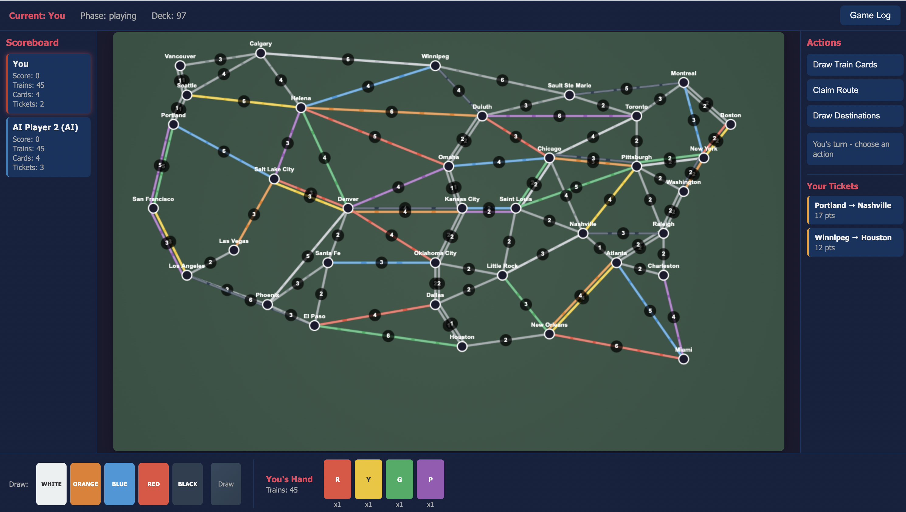

# Ticket to Ride - USA Edition

A browser-based implementation of the classic Ticket to Ride board game. Play solo against smart AI opponents or with up to 5 players!


## Screenshot



## Features

- **Full USA Map** - 36 cities and ~100 routes across America
- **1-5 Players** - Mix of human and AI opponents
- **Smart AI** - Strategic opponents that plan routes, collect cards, and block when beneficial
- **Complete Rules** - All official rules including longest route bonus (+10 points)
- **Interactive Map** - Click to claim routes, hover to see details
- **Real-time Scoring** - Track all players' progress on the scoreboard
- **Game Log** - Review all actions taken during the game

## How to Play

### Starting the Game

1. Clone this repository:
   ```bash
   git clone https://github.com/baofeng-dong/ticket-to-ride.git
   cd ticket-to-ride
   ```

2. Start a local web server:
   ```bash
   python3 -m http.server 8080
   ```

3. Open your browser to: **http://localhost:8080**

### Game Setup

1. Select the number of players (2-5)
2. Configure each player as Human or AI
3. Enter player names
4. Click "Start Game"
5. Each player receives 4 train cards and chooses destination tickets

### Turn Actions

On your turn, choose ONE action:

| Action | Description |
|--------|-------------|
| **Draw Train Cards** | Take 2 cards from face-up cards or deck. Taking a locomotive (wild) from face-up counts as both draws. |
| **Claim Route** | Play matching colored cards to claim a route between two cities. Gray routes accept any single color. |
| **Draw Destinations** | Draw 3 destination tickets and keep at least 1. |

### Scoring

| Route Length | Points |
|--------------|--------|
| 1 car | 1 point |
| 2 cars | 2 points |
| 3 cars | 4 points |
| 4 cars | 7 points |
| 5 cars | 10 points |
| 6 cars | 15 points |

**Bonus Points:**
- Completed destination tickets: +points shown on ticket
- Incomplete destination tickets: -points (penalty!)
- Longest continuous route: +10 points

### End Game

The game ends when any player has 2 or fewer trains remaining. Each player gets one final turn, then scores are calculated.

## Project Structure

```
ticket-to-ride/
├── index.html          # Main game page
├── css/
│   └── style.css       # Game styling
├── js/
│   ├── game.js         # Core game logic
│   ├── map-data.js     # USA map cities & routes
│   ├── cards.js        # Train cards & destination tickets
│   ├── player.js       # Player management
│   ├── ai.js           # Smart AI opponent
│   ├── scoring.js      # Scoring & longest route calculation
│   └── ui.js           # UI rendering
└── README.md
```

## Technologies

- **HTML5 Canvas** - Map rendering
- **Vanilla JavaScript** - Game logic (no frameworks)
- **CSS3** - Styling and animations

## License

This is a fan-made implementation for educational purposes. Ticket to Ride is a trademark of Days of Wonder, Inc.

---

*Built with Claude Code*
